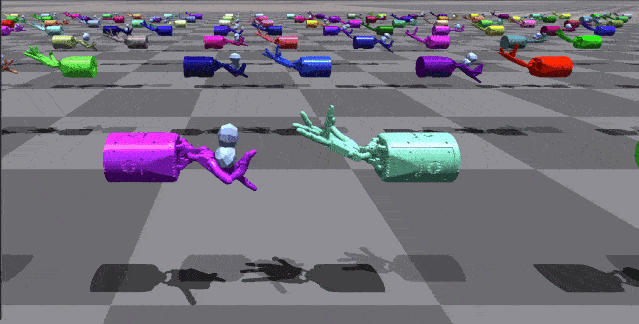
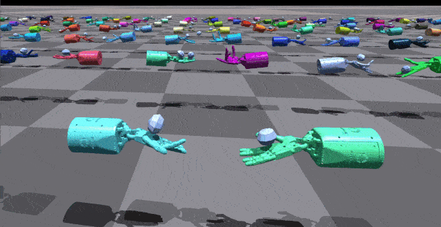
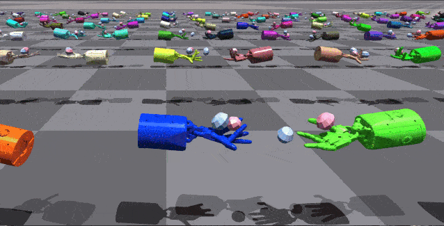
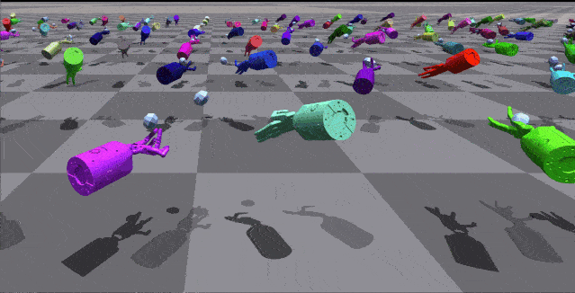
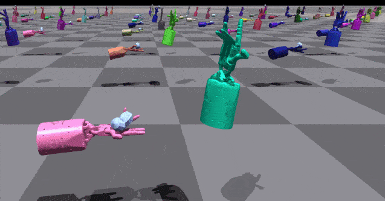

# Safe Multi-Agent Isaac Gym Benchmark (Safe MAIG)

Safe Multi-Agent Isaac Gym benchmark for safe multi-agent reinforcement learning research.

***
The README is organized as follows:

- [About this repository](#about-this-repository)
- [Installation](#installation)
  * [Pre-requisites](#pre-requisites)
  * [install this repo](#install-this-repo)
- [Running the benchmarks](#running-the-benchmarks)
- [Select an algorithm](#select-an-algorithm)
- [Select tasks](#select-tasks)
  * [HandOver Environments](#handover-environments)
    + [<span id="obs1">Observation Space</span>](#-span-id--obs1--observation-space--span-)
    + [<span id="action1">Action Space</span>](#-span-id--action1--action-space--span-)
    + [<span id="r1">Rewards</span>](#-span-id--r1--rewards--span-)
  * [HandCatchUnderarm Environments](#handcatchunderarm-environments)
    + [<span id="obs2">Observation Space</span>](#-span-id--obs2--observation-space--span-)
    + [<span id="action2">Action Space</span>](#-span-id--action2--action-space--span-)
    + [<span id="r2">Rewards</span>](#-span-id--r2--rewards--span-)
  * [HandCatchOver2Underarm Environments](#handcatchover2underarm-environments)
    + [<span id="obs3">Observation Space</span>](#-span-id--obs3--observation-space--span-)
    + [<span id="action3">Action Space</span>](#-span-id--action3--action-space--span-)
    + [<span id="r3">Rewards</span>](#-span-id--r3--rewards--span-)
  * [TwoObjectCatch Environments](#twoobjectcatch-environments)
    + [<span id="obs4">Observation Space</span>](#-span-id--obs4--observation-space--span-)
    + [<span id="action4">Action Space</span>](#-span-id--action4--action-space--span-)
    + [<span id="r4">Rewards</span>](#-span-id--r4--rewards--span-)
  * [HandCatchAbreast Environments](#handcatchabreast-environments)
    + [<span id="obs5">Observation Space</span>](#-span-id--obs5--observation-space--span-)
    + [<span id="action5">Action Space</span>](#-span-id--action5--action-space--span-)
    + [<span id="r5">Rewards</span>](#-span-id--r5--rewards--span-)
***


### About this repository

This repository is an extention of [DexterousHands](https://github.com/PKU-MARL/DexterousHands) which is from PKU MARL research team, Safe MAIG contains complex dexterous hand RL environments for the NVIDIA Isaac Gym high performance environments described in the NeurIPS 2021 Datasets and Benchmarks [paper.](https://openreview.net/forum?id=fgFBtYgJQX_)

:star2: This repository is under actively development. We appreciate any constructive comments and suggestions. If you have any questions, please feel free to email <gshangd[AT]foxmail.com>.

 <div align=center>
  
 </div>
<div align=center>
<center style="color:#000000;text-decoration:underline">Figure.1 Safe multi-agent Isaac Gym environments. Body parts of different colours of robots are controlled by different agents in each pair of hands. Agents jointly learn to manipulate the robot, while avoiding violating the safety constraints. </center>
 </div>

<!--

:star2::star2:**直接点击[这里](#task)查看环境介绍！**:star2::star2:  
:star::star:**现在每天都会更新，使用之前可以先pull一下防止出现无法运行等bug**:star::star:

Version 0.0.3: 
现在的视觉效果非常酷炫!:stuck_out_tongue_winking_eye:运行效率也得到了大大优化!:laughing:
1. 新加并测试了ShadowHandCatchAbreast环境.
2. 把多智能体细化到手指, 给加上了颜色分明的颜色，同一个智能体采用相同颜色, 一目了然.
3. 添加了支持不同智能体对应不同action dim的功能.
4. 添加了类似tianshou的plotter，可以将数据保存为csv文件并画图。添加了read the docs格式的文档，暂时存在docs文件夹里.
5. 为了适配isaacgym，将数据操作全在tensor(gpu)上完成，不需要经过cpu，极大提升速度:fire::fire:（现在已经是原来的大约20倍收敛速度了，而且还有优化空间）（现在半小时就能训练好一个环境）.
6. 添加了大量算法进库里，包括SAC，TD3，DDPG，TRPO，IPPO.

Version 0.0.2: 
现在已经全面支持Isaac-gym preview release 3了！并且不再支持Isaac-gym preview release 2.  
1. 在下面的[Task](#task)栏中添加了对环境的详细描述以及动图/截图.
2. 在参数文件中添加了transition和orientation scale，可以调整shadow hand移动和转动的速度.
3. 修复了另一只手没有scale的bug，修复了TwoObject环境另一个object的reset判定，现在基本没有系统性bug了.

Version 0.0.1: 由于硬件关系，现在只支持Isaac-gym preview release 2版本，可以在官网找到该版本。下面是一些使用方法:
1. 目前总共有4个dexteroushand环境，加上三个不同物体，详细说明和运行方法在下面。需要切换物体去该环境对应config`dexteroushandenvs/cfg/shadow_hand_over.yaml`中修改即可。
2. 目前支持的算法有PPO，MAPPO，HAPPO，HATRPO，需要调整算法可以去`dexteroushandenvs/algorithms/algorithms`，算法参数文件在`dexteroushandenvs/cfg`。
3. 暂时推荐使用ShadowHandOver环境进行调试，我们的测试已经证明该环境可以被成功训练，其他环境还暂时没有测试。
4. 环境的接口可以在`dexteroushandenvs/tasks/base/multi_vec_task.py`找到，里面可以自定义获取所有该环境的信息。 
5. 由于开发时间还比较短，难免会有许多bug:worried:，欢迎大家找我修改或提出建议:heart_eyes:。
-->

## Installation

Details regarding installation of IsaacGym can be found [here](https://developer.nvidia.com/isaac-gym). **We currently support the `Preview Release 3` version of IsaacGym.**

### Pre-requisites

The code has been tested on Ubuntu 18.04 with Python 3.7. The minimum recommended NVIDIA driver
version for Linux is `470` (dictated by support of IsaacGym).

It uses [Anaconda](https://www.anaconda.com/) to create virtual environments.
To install Anaconda, follow instructions [here](https://docs.anaconda.com/anaconda/install/linux/).

Ensure that Isaac Gym works on your system by running one of the examples from the `python/examples` 
directory, like `joint_monkey.py`. Follow troubleshooting steps described in the Isaac Gym Preview 2 
install instructions if you have any trouble running the samples.

### install this repo
Once Isaac Gym is installed and samples work within your current python environment, install this repo:

```bash
pip install -e .
```

## Running the benchmarks

To train your first policy, run this line:

```bash
python train.py --task=ShadowHandOver --algo=macpo
```

## Select an algorithm

To select an algorithm, pass `--algo=ppo/mappo/happo/hatrpo` 
as an argument:

```bash
python train.py --task=ShadowHandOver --algo=macpo
``` 

At present, we only support these four algorithms.
<!-- ### Loading trained models // Checkpoints

Checkpoints are saved in the folder `models/` 

To load a trained checkpoint and only perform inference (no training), pass `--test` 
as an argument:

```bash
python train.py --task=ShadowHandOver --checkpoint=models/shadow_hand_over/ShadowHandOver.pth --test
``` -->

<!--## <span id="task">Tasks</span>-->

## Select tasks

Source code for tasks can be found in `dexteroushandenvs/tasks`. 

Until now we only suppose the following environments:

| Environments | ShadowHandOver | ShadowHandCatchUnderarm | ShadowHandTwoCatchUnderarm | ShadowHandCatchAbreast | ShadowHandOver2Underarm |
|  :----:  | :----:  | :----:  | :----:  | :----:  | :----:  |
| Description | These environments involve two fixed-position hands. The hand which starts with the object must find a way to hand it over to the second hand. | These environments again have two hands, however now they have some additional degrees of freedom that allows them to translate/rotate their centre of masses within some constrained region. | These environments involve coordination between the two hands so as to throw the two objects between hands (i.e. swapping them). | This environment is similar to ShadowHandCatchUnderarm, the difference is that the two hands are changed from relative to side-by-side posture. | This environment is is made up of half ShadowHandCatchUnderarm and half ShadowHandCatchOverarm, the object needs to be thrown from the vertical hand to the palm-up hand |
| Actions Type | Continuous | Continuous | Continuous | Continuous | Continuous |
| Total Action Num | 40    | 52    | 52    | 52    | 52    |
| Action Values     | [-1, 1]    | [-1, 1]    | [-1, 1]    | [-1, 1]    | [-1, 1]    |
| Action Index and Description     | [detail](#action1)    | [detail](#action2)   | [detail](#action3)    | [detail](#action4)    | [detail](#action5)    |
| Observation Shape     | (num_envs, 2, 211)    | (num_envs, 2, 217)    | (num_envs, 2, 217)    | (num_envs, 2, 217)    | (num_envs, 2, 217)    |
| Observation Values     | [-5, 5]    | [-5, 5]    | [-5, 5]    | [-5, 5]    | [-5, 5]    |
| Observation Index and Description     | [detail](#obs1)    | [detail](#obs2)   | [detail](#obs3)    | [detail](#obs4)    | [detail](#obs4)    |
| State Shape     | (num_envs, 2, 398)    | (num_envs, 2, 422)    | (num_envs, 2, 422)    | (num_envs, 2, 422)    | (num_envs, 2, 422)    | 
| State Values     | [-5, 5]    | [-5, 5]    | [-5, 5]    | [-5, 5]    | [-5, 5]    |
| Rewards     | Rewards is the pose distance between object and goal. You can check out the details [here](#r1)| Rewards is the pose distance between object and goal. You can check out the details [here](#r2)    | Rewards is the pose distance between object and goal. You can check out the details [here](#r3)    | Rewards is the pose distance between two object and  two goal, this means that both objects have to be thrown in order to be swapped over. You can check out the details [here](#r4)    | Rewards is the pose distance between object and goal. You can check out the details [here](#r2)    |
| Demo     |     |     |     |     |     |


### HandOver Environments


These environments involve two fixed-position hands. The hand which starts with the object must find a way to hand it over to the second hand. To use the HandOver environment, pass `--task=ShadowHandOver`

#### <span id="obs1">Observation Space</span>

| Index | Description |
|  :----:  | :----:  |
| 0 - 23 | shadow hand dof position |
| 24 - 47     | shadow hand dof velocity    |
| 48 - 71     | shadow hand dof force    |
| 72 - 136    | shadow hand fingertip pose, linear velocity, angle velocity (5 x 13) |
| 137 - 166     | shadow hand fingertip force, torque (5 x 6)    |
| 167 - 186     | actions    |
| 187 - 193     | object pose   |
| 194 - 196     | object linear velocity    |
| 197 - 199     | object angle velocity    |
| 200 - 206     | goal pose    |
| 207 - 210     | goal rot - object rot   |

#### <span id="action1">Action Space</span>
The shadow hand has 24 joints, 20 actual drive joints and 4 underdrive joints. So our Action is the joint Angle value of the 20 dimensional actuated joint.
| Index | Description |
|  ----  | ----  |
| 0 - 19 | shadow hand actuated joint |

#### <span id="r1">Rewards</span>
Rewards is the pose distance between object and goal, and the specific formula is as follows:
```python
goal_dist = torch.norm(target_pos - object_pos, p=2, dim=-1)

quat_diff = quat_mul(object_rot, quat_conjugate(target_rot))
rot_dist = 2.0 * torch.asin(torch.clamp(torch.norm(quat_diff[:, 0:3], p=2, dim=-1), max=1.0))

dist_rew = goal_dist

reward = torch.exp(-0.2*(dist_rew * dist_reward_scale + rot_dist))
```

### HandCatchUnderarm Environments


These environments again have two hands, however now they have some additional degrees of freedom that allows them to translate/rotate their centre of masses within some constrained region. To use the HandCatchUnderarm environment, pass `--task=ShadowHandCatchUnderarm`

#### <span id="obs2">Observation Space</span>


| Index | Description |
|  :----:  | :----:  |
| 0 - 23 | shadow hand dof position |
| 24 - 47     | shadow hand dof velocity    |
| 48 - 71     | shadow hand dof force    |
| 72 - 136    | shadow hand fingertip pose, linear velocity, angle velocity (5 x 13) |
| 137 - 166     | shadow hand fingertip force, torque (5 x 6)    |
| 167 - 192     | actions    |
| 193 - 195     | shadow hand transition    |
| 196 - 198     | shadow hand orientation    |
| 199 - 205     | object pose   |
| 206 - 208     | object linear velocity    |
| 209 - 211     | object angle velocity    |
| 212 - 218     | goal pose    |
| 219 - 222     | goal rot - object rot   |

#### <span id="action2">Action Space</span>

Similar to the HandOver environments, except now the bases are not fixed and have translational and rotational degrees of freedom that allow them to move within some range.
| Index | Description |
|  :----:  | :----:  |
| 0 - 19 | shadow hand actuated joint |
| 20 - 22 | shadow hand actor translation |
| 23 - 25 | shadow hand actor rotation |

#### <span id="r2">Rewards</span>

Rewards is the pose distance between object and goal, and the specific formula is as follows:
```python
goal_dist = torch.norm(target_pos - object_pos, p=2, dim=-1)

quat_diff = quat_mul(object_rot, quat_conjugate(target_rot))
rot_dist = 2.0 * torch.asin(torch.clamp(torch.norm(quat_diff[:, 0:3], p=2, dim=-1), max=1.0))

dist_rew = goal_dist

reward = torch.exp(-0.2*(dist_rew * dist_reward_scale + rot_dist))
```

### HandCatchOver2Underarm Environments


This environment is is made up of half ShadowHandCatchUnderarm and half ShadowHandCatchOverarm, the object needs to be thrown from the vertical hand to the palm-up hand. To use the HandCatchUnderarm environment, pass `--task=ShadowHandCatchOver2Underarm`

#### <span id="obs3">Observation Space</span>


| Index | Description |
|  :----:  | :----:  |
| 0 - 23 | shadow hand dof position |
| 24 - 47     | shadow hand dof velocity    |
| 48 - 71     | shadow hand dof force    |
| 72 - 136    | shadow hand fingertip pose, linear velocity, angle velocity (5 x 13) |
| 137 - 166     | shadow hand fingertip force, torque (5 x 6)    |
| 167 - 192     | actions    |
| 193 - 195     | shadow hand transition    |
| 196 - 198     | shadow hand orientation    |
| 199 - 205     | object pose   |
| 206 - 208     | object linear velocity    |
| 209 - 211     | object angle velocity    |
| 212 - 218     | goal pose    |
| 219 - 222     | goal rot - object rot   |

#### <span id="action3">Action Space</span>

Similar to the HandOver environments, except now the bases are not fixed and have translational and rotational degrees of freedom that allow them to move within some range.
| Index | Description |
|  :----:  | :----:  |
| 0 - 19 | shadow hand actuated joint |
| 20 - 22 | shadow hand actor translation |
| 23 - 25 | shadow hand actor rotation |

#### <span id="r3">Rewards</span>

Rewards is the pose distance between object and goal, and the specific formula is as follows:
```python
goal_dist = torch.norm(target_pos - object_pos, p=2, dim=-1)
# Orientation alignment for the cube in hand and goal cube
quat_diff = quat_mul(object_rot, quat_conjugate(target_rot)
reward = (0.3 - goal_dist - quat_diff)
```

### TwoObjectCatch Environments


These environments involve coordination between the two hands so as to throw the two objects between hands (i.e. swapping them). This is necessary since each object's goal can only be reached by the other hand. To use the HandCatchUnderarm environment, pass `--task=ShadowHandTwoCatchUnderarm`

#### <span id="obs4">Observation Space</span>

| Index | Description |
|  :----:  | :----:  |
| 0 - 23 | shadow hand dof position |
| 24 - 47     | shadow hand dof velocity    |
| 48 - 71     | shadow hand dof force    |
| 72 - 136    | shadow hand fingertip pose, linear velocity, angle velocity (5 x 13) |
| 137 - 166     | shadow hand fingertip force, torque (5 x 6)    |
| 167 - 192     | actions    |
| 193 - 195     | shadow hand transition    |
| 196 - 198     | shadow hand orientation    |
| 199 - 205     | object1 pose   |
| 206 - 208     | object1 linear velocity    |
| 210 - 212     | object1 angle velocity    |
| 213 - 219     | goal1 pose    |
| 220 - 223     | goal1 rot - object1 rot   |
| 224 - 230     | object2 pose   |
| 231 - 233     | object2 linear velocity    |
| 234 - 236     | object2 angle velocity    |
| 237 - 243     | goal2 pose    |
| 244 - 247     | goal2 rot - object2 rot   |

#### <span id="action4">Action Space</span>

Similar to the HandOver environments, except now the bases are not fixed and have translational and rotational degrees of freedom that allow them to move within some range.
| Index | Description |
|  :----:  | :----:  |
| 0 - 19 | shadow hand actuated joint |
| 20 - 22 | shadow hand actor translation |
| 23 - 25 | shadow hand actor rotation |

#### <span id="r4">Rewards</span>

Rewards is the pose distance between two object and  two goal, this means that both objects have to be thrown in order to be swapped over. The specific formula is as follows:
```python
goal_dist = torch.norm(target_pos - object_pos, p=2, dim=-1)
goal_another_dist = torch.norm(target_another_pos - object_another_pos, p=2, dim=-1)

# Orientation alignment for the cube in hand and goal cube
quat_diff = quat_mul(object_rot, quat_conjugate(target_rot))
rot_dist = 2.0 * torch.asin(torch.clamp(torch.norm(quat_diff[:, 0:3], p=2, dim=-1), max=1.0))

quat_another_diff = quat_mul(object_another_rot, quat_conjugate(target_another_rot))
rot_another_dist = 2.0 * torch.asin(torch.clamp(torch.norm(quat_another_diff[:, 0:3], p=2, dim=-1), max=1.0))

dist_rew = goal_dist

reward = torch.exp(-0.2*(dist_rew * dist_reward_scale + rot_dist)) + torch.exp(-0.2*(goal_another_dist * dist_reward_scale + rot_another_dist))
```

### HandCatchAbreast Environments


This environment is similar to ShadowHandCatchUnderarm, the difference is that the two hands are changed from relative to side-by-side posture.. To use the HandCatchAbreast environment, pass `--task=ShadowHandCatchAbreast`

#### <span id="obs5">Observation Space</span>


| Index | Description |
|  :----:  | :----:  |
| 0 - 23 | shadow hand dof position |
| 24 - 47     | shadow hand dof velocity    |
| 48 - 71     | shadow hand dof force    |
| 72 - 136    | shadow hand fingertip pose, linear velocity, angle velocity (5 x 13) |
| 137 - 166     | shadow hand fingertip force, torque (5 x 6)    |
| 167 - 192     | actions    |
| 193 - 195     | shadow hand transition    |
| 196 - 198     | shadow hand orientation    |
| 199 - 205     | object pose   |
| 206 - 208     | object linear velocity    |
| 209 - 211     | object angle velocity    |
| 212 - 218     | goal pose    |
| 219 - 222     | goal rot - object rot   |

#### <span id="action5">Action Space</span>

Similar to the HandOver environments, except now the bases are not fixed and have translational and rotational degrees of freedom that allow them to move within some range.
| Index | Description |
|  :----:  | :----:  |
| 0 - 19 | shadow hand actuated joint |
| 20 - 22 | shadow hand actor translation |
| 23 - 25 | shadow hand actor rotation |

#### <span id="r5">Rewards</span>

Rewards is the pose distance between object and goal, and the specific formula is as follows:
```python
goal_dist = torch.norm(target_pos - object_pos, p=2, dim=-1)

quat_diff = quat_mul(object_rot, quat_conjugate(target_rot))
rot_dist = 2.0 * torch.asin(torch.clamp(torch.norm(quat_diff[:, 0:3], p=2, dim=-1), max=1.0))

dist_rew = goal_dist

reward = torch.exp(-0.2*(dist_rew * dist_reward_scale + rot_dist))
```
